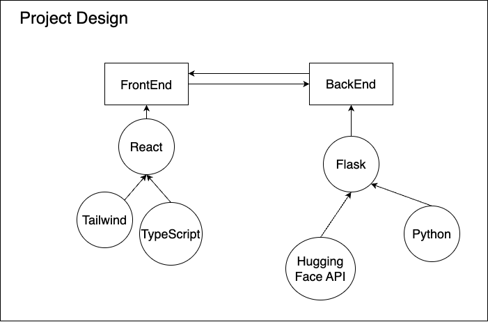

# ChatClarity

### An Experiment project to generate whats app group chat analytics and summerization

#### Library used:
1. Pandas
2. Plotly
3. Flask
4. Nltk
5. Huggingface transformers

### Progress
#### [Date: 10-03-2014] 
1. [Before noon] created virtual environment and initiated flask experimentation
2. [Before Night] exp: upload file, render file (HTML), static and templates file working understanding.

#### TODO
1. Create Flask server, expand `utils.py`
2. Add analytics using `plotly`
3. Experiment with `plotly.js` to embed this in web
4. add test codes
5. Dockerize the application.
6. Deploy in cloud run.