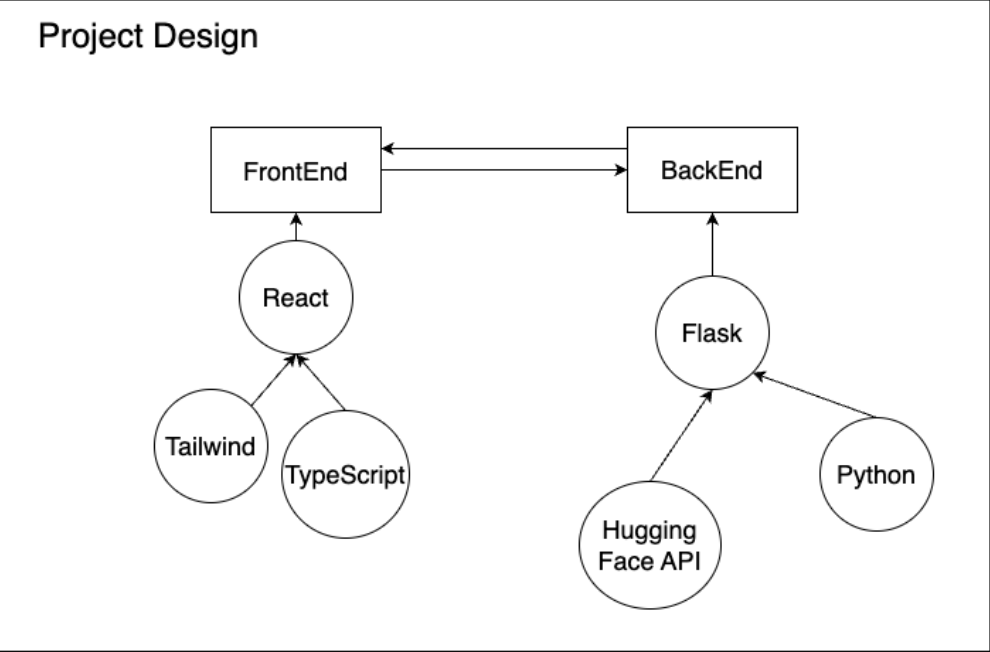

# ChatClarity

### An Experiment project to generate whats app group chat analytics and summerization

# React + Vite

This template provides a minimal setup to get React working in Vite with HMR and some ESLint rules.

Currently, two official plugins are available:

- [@vitejs/plugin-react](https://github.com/vitejs/vite-plugin-react/blob/main/packages/plugin-react/README.md) uses [Babel](https://babeljs.io/) for Fast Refresh
- [@vitejs/plugin-react-swc](https://github.com/vitejs/vite-plugin-react-swc) uses [SWC](https://swc.rs/) for Fast Refresh

#### Library used:
1. Pandas
2. Plotly
3. Flask
4. Nltk
5. Huggingface transformers

### Progress
#### [Date: 10-03-2024] 
1. [Before noon] created virtual environment and initiated flask experimentation
2. [Before Night] exp: upload file, render file (HTML), static and templates file working understanding.

#### [Date: 11-03-2024]
1. [Before Noon] restricted the file to only txt file uploads, and also secured the file uploading to protect system files, configured upload folder, taken input file and geerated graph from it (user vs msg count graph)

#### TODO
1. Create Flask server, expand `utils.py`
2. Add analytics using `plotly`
3. Experiment with `plotly.js` to embed this in web
4. add test codes
5. Dockerize the application.
6. Deploy in cloud run.