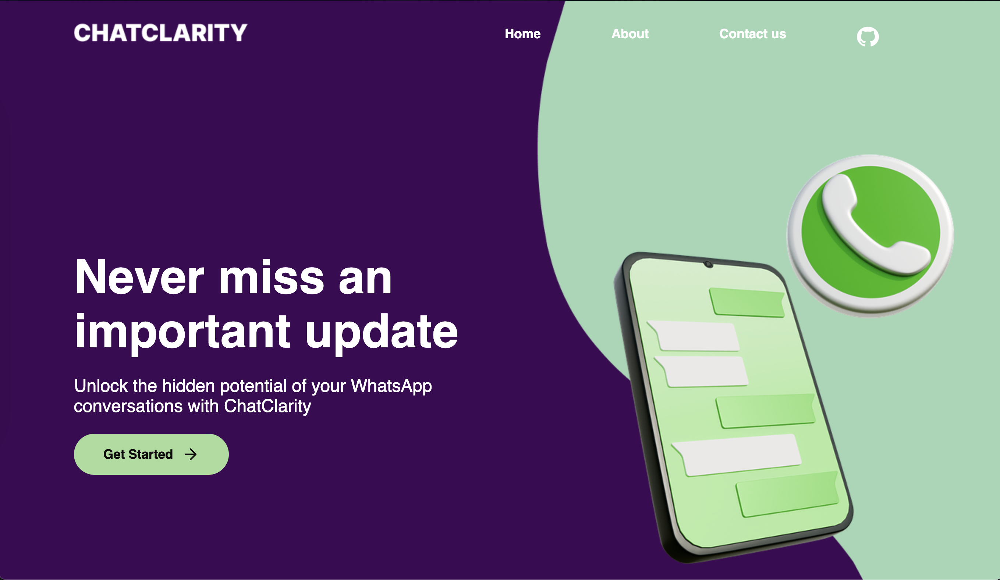
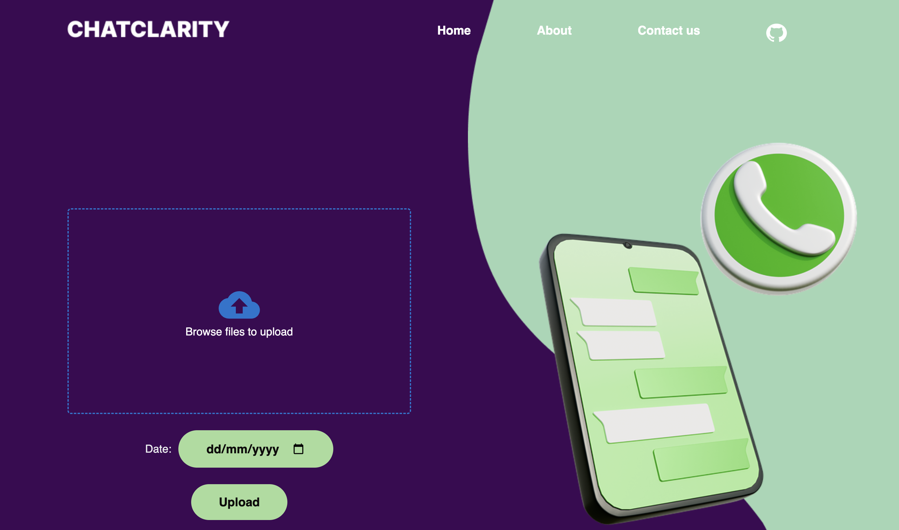
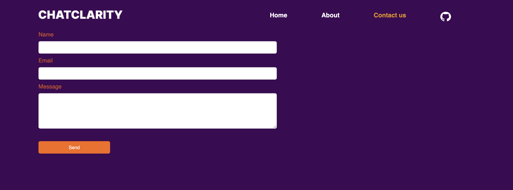
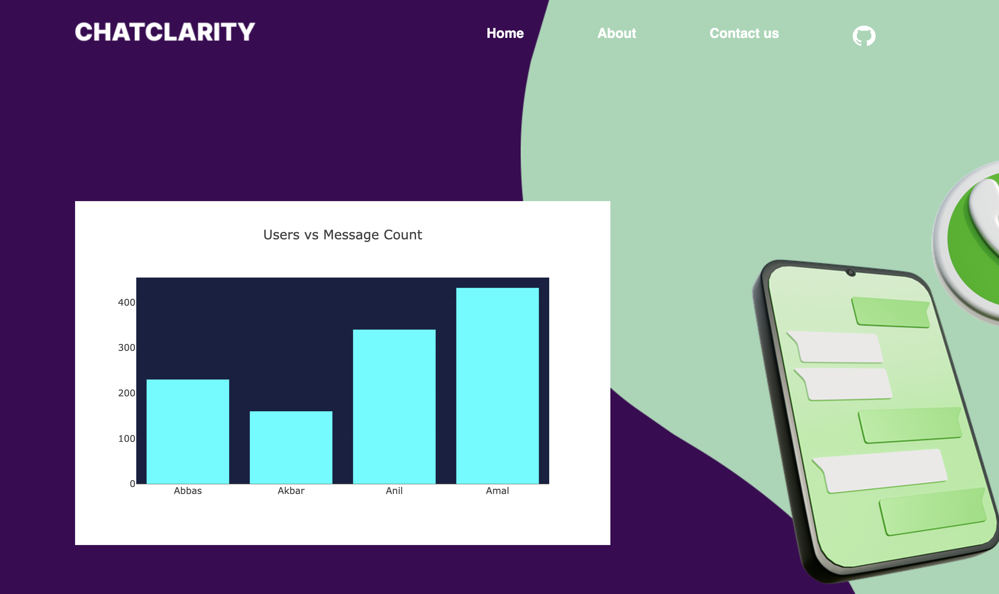

# ChatClarity

### An Experiment project to generate whats app group chat analytics and Searching (powered by AI)

###  Screenshots
1. Home page of the Application

2. Uploading Page of the Application

3. Contact Us Page of the Application

4. Analytics Page (Working on it..)

### Our Motive:
1. Chat analytics and searching tool
2. Keep you updated
3. Faster access to desired old messages and updates by Important persons.

### Contribution
#### Tech Stack:
**Frontend:**

- React with JS
- react-plotly
- plain CSS (for styling)

**Backend:**

- Flask and Python
- Numpy, Pandas for data processing
- Hugging Face API
- Temsorflow (implementing ..)

*Come, contibute to this repository, get your first **"Pull Shark Badge"** and make this a successful open source project.*